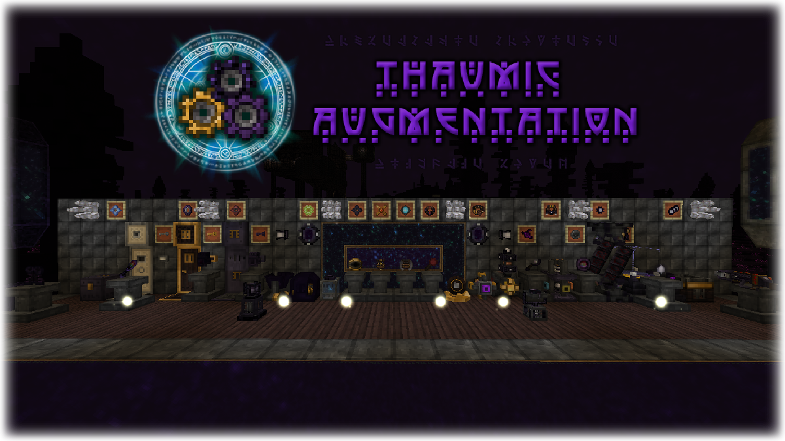

======
Thaumic Augmentation is a Thaumcraft addon for Minecraft 1.12 that tries to add new content that would fit in with the base mod.

For downloads, visit the [project's page on CurseForge](https://minecraft.curseforge.com/projects/thaumic-augmentation).

Features
------
* Upgraded casting gauntlets (Thaumium and Void)
* A machine to (slowly) add vis back to the aura
* A tool that can copy and paste golem seal settings
* Boots of the Riftstrider, an upgraded version of the Boots of the Traveller
* Warded (personal) chests, doors, and trapdoors with keys to allow access to others
* A focus effect that creates light
* A reimplementation of the ward focus from older versions of Thaumcraft
* An augment system to add additional components to casting gauntlets and other items
* Find dimensional fractures to enter a brand new dimension - the Emptiness.

License
-----
Thaumic Augmentation is licensed under the GNU Lesser Public License v3 (or later). So that means if you want to include this mod in a modpack, go right ahead!

Contributing
-----
For information on contributing to the project (and thank you for considering helping out), see [CONTRIBUTING.md](CONTRIBUTING.md).